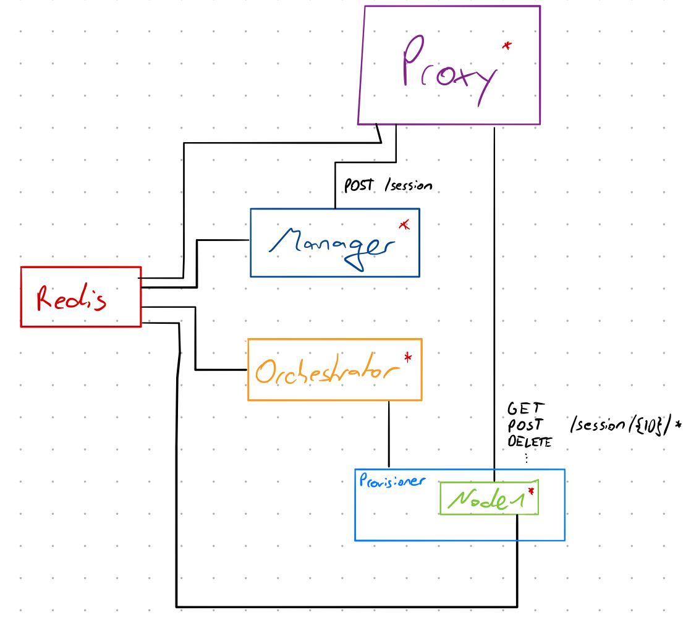
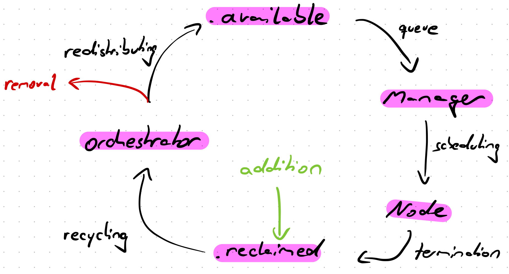

# Core services

The WebGrid core consist of multiple services which interoperate to provide the reliable scaling functionality. Namely these are:

- Node
- Orchestrator (+ Provisioner)
- Manager
- Storage
- Proxy

Below is a detailed description of the high-level responsibility of each service and their logical layout. The ones marked with a red asterisk can be scaled on-demand.

## Node
At the core of each WebGrid are desktop environments which contain a Browser and additional software like the WebDriver[^e.g. `geckodriver` for Firefox] and a video encoder. The concept of a Node has been employed to abstract the underlying hardware & software logic of controlling the desktop environment, recording software and WebDriver away, leaving a clean interface for the Proxy[^Note that it rewrites incoming requests to change the external session ID to the one assigned by the local WebDriver]. Nodes start the driver, provide lifecycle information about the running session and handle cleanup when the session terminated. They have a very linear and simple service lifecycle:

- Start local driver
- Start screen recording
- Handle and forward WebDriver requests
- Terminate

It does not matter whether or not a Node is running bare-bones on your Desktop or contained within larger infrastructure like a Kubernetes Cluster as long as the Proxy can reach it. Requests are forwarded to it through the proxy at `* /session/${SID}/*`

## Orchestrator
Since the lifespan of a Node is tied to one specific session there needs to be an instance which handles the creation and deletion of them. The Orchestrator receives instructions from the Manager to create new Nodes and returns information on how to reach them.

An Orchestrator can have multiple Node configurations available to choose from (e.g. different Browsers) and provides these capabilities to the Manager as a HashMap. Usually Orchestrators parse and forward the requests to create new nodes to a Provisioner like Docker or K8s however they can also just launch a local process.

### Slots
One given Orchestrator may not have an unlimited amount of resources at its disposal. To constrain the number of Nodes that can exist at one given time, controlled by one given Orchestrator a concept of slots has been introduced.

They are basically just IDs which are generated when the service is created and resemble "Coupons" which the Manager can use to request the creation of a Node. A slot is associated with one session on creation, if available and stays bound until the session is terminated at which point it is returned into the list of available slots for a new session to retrieve.

Since any given service may die while processing requests each slot has a "parent" which is responsible for it. While a Node is running, it has the responsibility for its own slot. If it dies unexpectedly (and thus its heartbeat ceases to exist) the Orchestrator may reclaim its slot, adding it back to the list of available ones. This process is explained in more detail in the [Workflows](./workflows.md) document.

Here is an image of the slot lifecycle:

## Manager
The Manager processes requests from clients to create new sessions by determining which orchestrators match the requested capabilities, requesting a slot and verifying the Node scheduling and startup process. A session leaves the responsibility of the manager as soon as the startup sequence has completed. For more details consult the [Scheduling Workflow](./workflows.md).

It receives requests through the proxy at `POST /session`

## Storage
In order to access files that sessions stored on disk a server instance with access to them is needed. For this purpose a storage service exists which delivers resources like screen recordings and manages storage occupancy by monitoring a local directory and potentially running cleanup tasks based on a local SQLite database.

It receives requests through the proxy at `GET /storage/${SID}/*`.

## Proxy
In order to route session traffic to the node that is hosting the session a reverse proxy is required. For this purpose (and load-balancing in a scenario with more than one manager instance) a service has been added.

It listens on Redis key-space notifications to detect managers and nodes coming online or going offline, determined by their heartbeat. When a node comes online, the proxy routes all requests of the corresponding session (`/session/<ID>*`) to the node. For managers it routes requests matching `POST /session` to a randomly selected upstream from the list of alive managers.

## Garbage collector
As mentioned in the [database documentation](./database.md#garbage-collection), this service is responsible for removing old and unused keys from the database. Additionally, it has the task of resolving undefined states in the dataset which e.g. occured due to outages. This includes the termination of old sessions which have not been cleaned.
