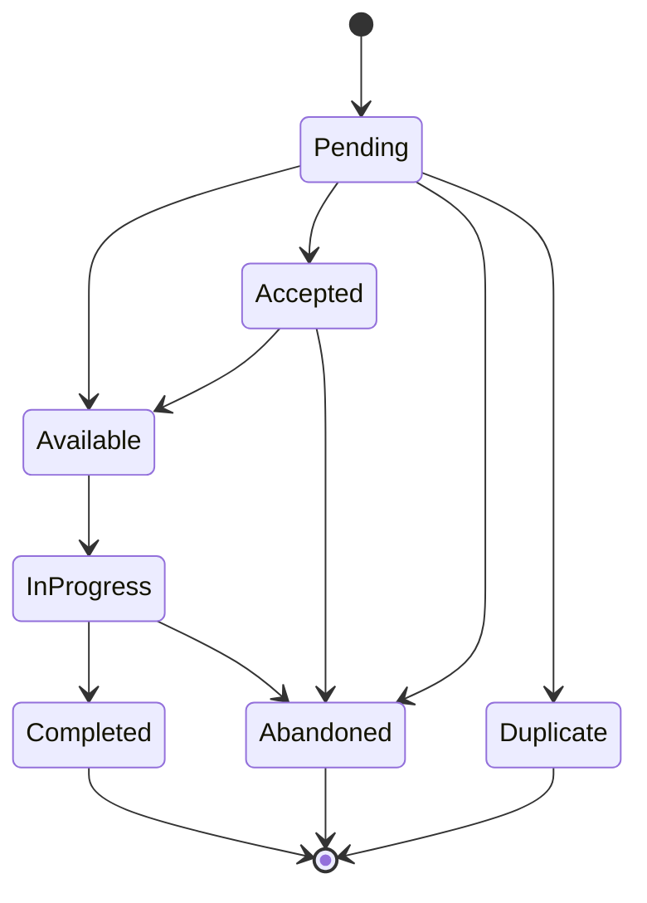

# Issue reporting

Creating an issue is the easiest way to contribute to the project! All issues are tracked using the [GitHub Issue Board](https://github.com/TilBlechschmidt/WebGrid/issues). There are four different types of issues:

| Type                                                             | Description                                                                       |
|------------------------------------------------------------------|-----------------------------------------------------------------------------------|
|                     | Issues that affect the functionality of the software                              |
|    | Feature requests or ideas that would improve the project                          |
|  | Improvements to code quality, readability, documentation or architecture          |
|        | General questions about the project, how it works and for non-documented features |

## Reporting

If you have a question, encountered a bug or want to suggest a feature **please don't hesitate to [open a ticket](https://github.com/TilBlechschmidt/WebGrid/issues/new)** — Community feedback helps the project grow and adapt in the best possible way!

!!! important "Preventing duplicates"
    Make sure to browse the [issue backlog](https://github.com/TilBlechschmidt/WebGrid/issues?q=is%3Aopen) and [previously closed issues](https://github.com/TilBlechschmidt/WebGrid/issues?q=is%3Aclosed+) as well as the [FAQ](../faq.md) to see if somebody else already covered your topic! This helps us focus on implementing your ideas and helping you with issues instead of housekeeping duplicates.

## Lifecycle

Each ticket goes through the following lifecycle outlined below:

In addition to the states shown above, it may enter one of the following states from almost any other state:

| Status                                                                  | Description                                                                            |
|-------------------------------------------------------------------------|:---------------------------------------------------------------------------------------|
|                    | Waiting for another issue to be resolved                                               |
|                  | Waiting for external response/feedback to continue down the issue lifecycle            |
|  | The proposed solution needs to be revised and changed according to maintainer feedback |
|   | A solution has been proposed and needs to be reviewed by a maintainer                  |

For a more detailed description of all possible states, consult the [repositories label page](https://github.com/TilBlechschmidt/WebGrid/labels).

## Pull requests

In addition to the labels of issues, Pull Request may have additional labels which identify the type of version bump.

| Change                                               | Description                                                                   |
|------------------------------------------------------|:------------------------------------------------------------------------------|
|  | New feature that breaks backwards compatibility and requires a manual upgrade |
|  | Backwards compatible feature addition that can be upgraded automatically      |
|  | Minor changes like backwards compatible bug fixes and documentation changes   |